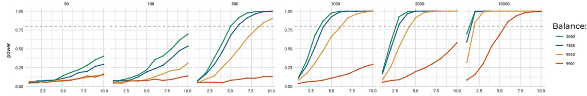

# Mastering A/B/N Testing with Lyft's Ride Sharing Feature Optimization

#### Article Summary and Inspiration

This article aims to present a ***comprehensive checklist*** for experimental design and execution, using feature optimization of Lyft's shared rides as a real-world application example in each section. It is inspired by the lack of easily accessible, comprehensive A/B testing guides and the research I conducted for final round interviews at Lyft. Although the role was filled before my interview date, this experience motivated me to understand the testing process from start to finish, including possible edge cases.

In this article:
- I first walk through all the design and execution considerations of an A/B/N test in the General Framework section, providing aimed at optimizing the maximum wait times shown to users requesting shared rides.
- Secondly, I revise key ideas to be wary of while designing and executing an A/B test in the Malpractices to Avoid section.
- Finally, I provide a thorough plan for setting up an A/B/N test for the max wait time feature of Lyft's shared rides service.

The plan meticulously outlines the experimental design, including identifying key metrics such as ride cancellations, feature usage, and overall app interaction, defining key stratification features, and avoiding two-sided market dependencies. The experiment utilizes a combination of continuous, categorical, and binary metrics to evaluate both direct impacts on user experience and indirect effects on Lyft's operational efficiency. Additionally, it details the importance of stratification and careful sample sizing to ensure robustness and accuracy in the results. The goal is to accurately measure how changes in wait times influence user decisions and overall satisfaction, guiding Lyft in optimizing their service to better meet customer needs and enhance profitability.

 

#### Table of Contents
- [The Basics](#the-basics)
- [General Framework](#general-framework)
- [Malpractices to Avoid](#malpractices-to-avoid)
- [Lyft Example](#lyft-example)

 

#### A Request from You, the Reader

I put lots of thought into note optimization, in terms of layout and sequence of information, so that when working on a problem, the header you most naturally look for has all the information you would need at that part of your project, and in the order you will likely need to think about it in.
1. If you have any ideas for how an A/B Testing guide could be better organized to deliver relevant info at any section within this guide, please let me know!
2. As well, if you come across a section and know of an edge case or good practice that is not mentioned, I'd love to recommit the article with your method included, with a tag to your Github or LinkedIn!

   

## The Basics

 

**A/B Testing**

This is the business world's term for randomized controlled trials, the human race’s gold standard determining causal relationships between variables. By serving two variants (A and B) of the same variable while controlling for or randomizing all known confounding variables, researchers can gather data on which variant leads to a more favorable outcome. This method is instrumental in decision-making, allowing companies to optimize their services based on empirical evidence rather than assumptions.

 

**A/B/N Testing**

This is simply A/B testing with more than two variants of the same variable.

 

**Multivariate Testing**

This means varying two or more variable in concert, and enables testing of interaction effects between variables. This is in contrast to performing an A/B/(N) test separately for each variable, where the set of separately winning variables may not be the set that maximizes the KPIs chosen.

For example, in the classic website example, navy blue font may improve click-through rate over other colors, and small button size may improve the same KPI over other sizes, but black font with medium button size may have a higher click through rate than any other color and button size combination. Separate A/B/N tests, unable to test for interaction effects, would falsely choose navy blue and small button size.

   

## General Framework

My general framework for A/B/N testing consists of six main steps:
1. [Identify Metrics](#1-identify-metrics)
2. [Design the Experiment Setup](#2-design-the-experiment-setup)
    - [Test Type](#2a-test-type)
    - [Unit of Randomization and Diversion](#2b-unit-of-randomization-and-diversion)
    - [Stratification along Invariant Measures](#2c-stratification-along-invariant-measures)
    - [Stratification along Time](#2d-stratification-along-time)
    - [Screening / Filtering](#2e-screening--filtering)
    - [Sample Ratio](#2f-sample-ratio)
    - [When to Run](#2g-when-to-run)
    - [When to Start Measuring](#2h-when-to-start-measuring)
3. [Determine Statistical Test and Sample Size](#3-determine-statistical-test-and-sample-size)
    - [Hypothesis Tests](#3a-hypothesis-tests)
    - [Hypotheses, Power, and Minimum Detectible Effect](#3b-hypotheses-power-and-minimum-detectible-effect)
    - [Sample Size](#3c-sample-size)
4. [Run Test and Analyze Results](#4-run-test-and-analyze-results)
    1. [Sanity Checks during Data Collection](#4a-sanity-checks-during-data-collection)
    2. [Analyze Data, Make Decision or Troubleshoot](#4b-analyze-data-make-decision-or-troubleshoot)
    3. [Rollout Period](#4c-rollout-period)

 

Click here to return to the [Table of Contents](#table-of-contents).

 

### 1) Identify Metrics
---

Before any hypothesis testing or testing design is performed, we must define success by carefully considering the following types of metrics: evaluation metrics, counter metrics, guardrail metrics, and invariant metrics.

 

**Evaluation Metrics**

Metrics that we hypothesize will have a favorable change between control and treatment. These should exactly or approximately measure the feature change objective while also considering the short- and long-term goals of the business.

 

**Counter Metrics**

Metrics that we hypothesize could get worse due to the treatment. The boundary between evaluation and counter metrics is grey, and some analysts will consider them within the same group, but I think the distinction helps push the analyst to consider potential negative effects of the proposed feature change.

Counter metrics also include those that have an unfavorable change if the treatment is being used in a way we do not want or anticipate. For example, let's say that the treatment is a discount coupon trial, but we find that most coupons are used by new customers that purchase only the coupon product. If we looked only at immediate evaluation metrics like sales and customer traffic, the coupon trial would look like a complete success. But if we also included metrics that we expect might get worse with misuse of the coupon, like revenue and customer retention, we would be better equipped to understand the true effect of the trial.

 

**Guardrail Metrics**

Metrics that should remain stable across the experiment to ensure the test's integrity. These metrics are monitored during the experiment as well as during the analysis stage to check for errors in the data collection process before drawing conclusions from the data.

*Sample Ratio* is the ratio of number of samples assigned to a treatment group vs its control. This guardrail metric is present in every experiment, even pair tests and multi-exposure tests. If at some point in the experiment the sample ratio deviates from the target ratio, there is likely a sampling or instrumentation error present, both of which are likely to bias the results.

 

**Invariant Metrics**

Metrics that are known or hypothesized confounders of the evaluation metrics. Most experimental designs will stratify by invariant metrics before assigning units to experimental groups; see [Stratification along Time](#2d-stratification-along-time) for details.

Common invariant metrics are:
- ***Seasonality***: a specific time of day, day of week, day of month, or part of year.
- ***Demographics***: age, sex, gender, race, education level, employment status, marital status, occupation, religious affiliation.
- ***Location***: specific location, urban vs suburban vs rural vs airport, tourist binary.
- ***New User***. whether the user has experienced the product before testing the feature change. This metric is necessary for determining novelty effect unbiased by other confounders.

 

<u>**Example Application**</u>

Here are the top metrics that I would focus on for our max wait time example with Lyft's ride share feature.

Evaluation metrics:
1. Cancellations on Wait-Time Screen:
    - Upon entering a destination, the Lyft user is presented with a list of methods to transport them and prices for each. Once they choose "shared ride", they wait to be matched with a driver and another user, and then receive a wait time. The most immediate response to seeing the wait time is to cancel or wait for the ride.
    - This would be a binary variable tracking, for each instance that a ride is requested an a wait time is given, whether the user cancels the ride before starting the trip.
2. Feature Usage:
    - Our example conditions on users who are already interested in shared rides. Users may link long wait times to the shared ride feature and decide to avoid the feature if they experience wait times above their max preference.
    - I would track the number of shared-rides per unit of time chosen for randomization.
3. App Usage:
    - We should also consider how varying the wait time affects user's general preference for Lyft over competitors like Uber and substitutes like public transit.
    - I would track the number of times the app is opened and any product is interacted with, per unit of time chosen for randomization.
4. Shared-Rides Gross Profit:
    - In a two sided market with algorithm-controlled incentives and pricing, there are many moving parts. Including a metric that tracks the revenues and expenses of operations directly linked to shared rides gives us a method to catch and diagnose unforeseen effects of our max wait time treatments.
    - This metric assumes that the revenues, incentives, base driver pay, and other expenses of shared rides can be separated from other business operations like non-shared rides.

Counter metrics:
1. Customer App Ratings:
    - Optimally, I would test ride ratings and app ratings, but if I had to choose one option to keep the metric list short, I would choose app ratings to include users that are turned away by excessive wait times and never get a change to rate a ride after being given a treatment.
    - This would be a categorical variable tracking the rating from 1 to 5 stars, for each rating a user submits.
2. Driver App Ratings:
    - Lyft operates in a two-way market. Without satisfied drivers, there is no Lyft service. Its possible that changing max wait time changes how some drivers experience the rider assignment algorithm. Thus, I would also catch any unforeseen problems for drivers with this feature.
    - This would be a categorical variable tracking the rating from 1 to 5 stars, for each rating a driver submits.
3. Cancellations on Finding-Driver Screen:
    - As well as user behavior, we should consider algorithm behavior. Decreasing the max wait time means the matching algorithm will wait to give users a ride until a driver and shared ride user are close enough, potentially leading to the same wait times, just on a different waiting screen. Thus, we should also measure cancellation rate and average wait time for the period between selecting shared rides and receiving a driver and wait time.
    - This would be a binary variable tracking, for each instance that a ride is requested, whether the user cancels the ride before an a wait time is given.

Invariant metrics:
1. Hour and Day:
    - Users are more likely to be rushed or relaxed during certain hours of the day and days of the week. Morning periods on weekdays likely have many rushed users going to work, whereas morning periods on weekends likely have many less rushed users.
2. Pick-up / Drop-off Location:
    - As well as time metrics, rushed and relaxed users are likely to be correlated to the location they order from. Rush users are more likely to be leaving the house (e.g., going to work or to an event or hobby with scheduled hours) or going to specific locations (e.g. the airport). Relaxed users are more likely to be returning home (e.g., from work or from an event or hobby).
3. Loyal vs Efficient:
    - The max wait time a customer is comfortable with is likely different between customers who regularly check multiple ride-hailing apps when searching for a ride (the market "efficient" users) and customers that only check the Lyft app (the "loyal" customers").

 

### 2) Design the Experiment Setup
---

After defining how we will measure success and health of the test, as well as considering what confounders to stratify across, we go through a checklist of experimental design considerations which will allow us to determine the viable statistical tests and sample size.

Our experiment checklist is as follows:
- [Test Type](#2a-test-type)
- [Unit of Randomization and Diversion](#2b-unit-of-randomization-and-diversion)
- [Stratification along Invariant Measures](#2c-stratification-along-invariant-measures)
- [Stratification along Time](#2d-stratification-along-time)
- [Screening / Filtering](#2e-screening--filtering)
- [Sample Ratio](#2f-sample-ratio)
- [When to Run](#2g-when-to-run)
- [When to Start Measuring](#2h-when-to-start-measuring)

 

### 2a) Test Type
---

Depending on the below considerations, we can choose between using a separate subjects test, one or more paired tests, or a multi-exposure test.

 

**Separate Subjects Test**

In a separate subjects test, units of randomization are assigned to either the control or one of the treatment groups. This method is simple but fails to account for variability in confounders between the treatment and control groups. Invariant metrics are often used to track these confounders.

This approach is typically chosen when multi-pair testing is not feasible, or when potential variability across time is a significant concern.

 

**Pair Tests**

In pair tests, units of randomization are exposed to both the control and one of the treatment groups, usually exposing subjects to the control first.

In comparison to separate subject tests, this method is more powerful as it accounts for variability in confounders between the control and treatment groups. However, it adds variability that occurs through time. When a sample unit can receive both a treatment and the control, this test is often preferred.

In comparison to multi-exposure tests, this method fails to account for variability between treatment groups, but is a necessary choice over multi-exposure tests when spillover / carryover effects cannot be avoided without a washout period or specific ordering.

 

**Multi-Exposure Test**

In a multi-exposure test, each unit of randomization is exposed to all treatments, including the control, in a specific order. This method accounts for variability in confounders between the control and all treatment groups. Two considerations for whether a multi-exposure test is viable are washout time and onset time.
- ***Washout time***: the period needed for previous treatment effects to fully dissipate. Multi-exposure tests are usually chosen over pair tests when (1) the treatment effects are not permanent and the required washout time is acceptable, or when (2) carryover effects are redundant for a specific ordering of treatments.
    - For example, if the treatments are of the same feature and vary by magnitude, and the effect being measured is number of users dropping out, we can assume that all users that dropped out at the lower magnitude and are now not available to be tested by the higher magnitude, would have dropped out from the higher magnitude.
- ***Onset time***: the period needed to realize the full effect of the treatment. Multi-exposure tests are usually chosen over pair tests when treatments take effect quickly, for example click-through rate, but are less viable for delayed-effect treatments like referral programs.

 

<u>**Example Application**</u>

We can quickly see that more powerful paired tests are favored over separate subject tests since:
1. It is very feasible to give a single user both the control and a treatment (i.e., longer max wait time).
2. The change in user preference to max wait times is unlikely to vary over the time it takes to apply the control and one longer max wait time.

Comparing a series of paired tests to a multi-exposure test:
1. It is feasible to give multiple treatments (i.e., multiple max wait times) to a single user.
2. Carryover effects are likely to be strong and varied, as some users make the conscious or subconscious decision to avoid the app or shared ride option after encountering a wait time above their limit, whereas others will be less affected by an excessive max wait time and return to the ride share feature shortly after.

Since the carryover effects are likely to be varied and strong, disentangling them or setting a reasonable washout period is not viable. Thus, I would suggest a series of paired tests where each user receives the control and then one longer, treatment max wait time.

Without having previous data from Lyft to base these values on, I would set the control wait time at 2 minutes, and test 5 more wait times at 3.5 minutes, 5 minutes, 7.5 minutes, 10 minutes, and 15 minutes.

 

### 2b) Unit of Randomization and Diversion
---

**Unit of Randomization**

The entity or level at which samples are assigned to treatment or control groups in an experiment. This decision critically influences the statistical validity of the experiment and the extent of random variation between groups. For example, in social network experiments, dependence between users is handled by randomizing by network-like clusters of users instead of by individuals.

**Unit of Diversion**

Also known as the *split criterion* or *dividing criterion*, the unit of diversion is the label by which the units of randomization are trafficked into different groups. You can think of it as the functional method by which to apply the unit of randomization chosen. Common examples include user ID, device ID, and cookies.

 

<u>**Independence Assumption Violations**</u>

The choice of randomization unit can keep intact our "independence between units" assumption in tricky cases. For many experiments, the units of randomization will simply be users, but caution must be taken when applying A/B testing to the below phenomena.

 

**Two-Sided Markets**

In two-sides markets, the independence assumption violation is mainly due to ***resource sharing*** between groups, meaning an effect in one group takes resources from the other group, which ***overestimates*** any positive or negative effect. For example, when testing riders or drivers of a ride-hailing operation, a successful treatment will take riders or drivers away from the control group, removing dependence between the control and treatment.

Preventions include geo-based and time-based randomization.
- ***Geo-based*** randomization means creating units on geographical regions where users between regions interact less frequently than the users within each region. For a ride hauling app, randomizing per city could be a viable choice. If the geographical region chosen or needed is large, the will be a small sample size, in which case qualitative care should be taken to ensure each treatment group and the control group have equal counts of regions with equal or similar characteristics as it pertains to the phenomenon being tested.
- ***Time-based*** randomization means creating units on short intervals of time. Users are then exposed to a treatment or the control assigned to that period of time.
    - Naturally, this described a specific implementation (unordered) of the multi-exposure method mentioned in the above section, so it comes with the same considerations about washout time and onset time.
    - If a *separate subjects test* or *paired tests*

 

**Social Networks**

In social networks, the independence assumption violation is mainly due to the ***network effect*** spilling over into the control group, which ***underestimates*** any positive or negative effect.

Preventions revolve around clustering.
- **Network cluster** randomization means clustering units by the frequency of activity with each other unit, and assigning each cluster to a treatment or the control group. The threshold chosen for frequency of interaction between units is a tradeoff between ensuring independence between units, and achieving the necessary sample size.
- **Ego clusters** is one recent network cluster technique proposed by Saint-Jacques et al. (2019) in their paper "[Using ego-clusters to measure network effects at LinkedIn.](https://arxiv.org/pdf/1903.08755)". It builds granular clusters using only first-degree connections and breaks overlap conflicts by ranking clusters by degree centrality (number of connections).

 

<u>**Example Application**</u>

Lyft operates in a two sided market, so our independent units assumption is false if we chose users as the only unit of randomization. Our two known options are geo-based and time-based randomization. Geo-based randomization is not a great resolution for our Lyft example because geographical regions are likely to be strongly dependent until we zoom out to the city level, at which point the number of units (number of cities) is very small, making it difficult to create treatment and control groups with equal distributions of confounding variables. Time-based randomization is a great option as our treatments will likely have an immediate effect on users.

The units of randomization would therefore be users and time, and the units of diversion would be user identifiers. Specifically, I would run the trial over a two week period and divide this experimental period into 2016 10-minute time-units. Since I've chosen a series of paired tests, I would first randomize by users to fill the g treatment and control groups, and then randomize assignment of each time-unit to one of the g groups.

Although using a single, long time period per group would avoid the resource sharing problem of Lyft's two-sided market, as you will see in [Stratification along Time](#2d-stratification-along-time), randomizing by multiple, short periods allows us to accounting for time as a confounder.

 

### 2c) Stratification along Invariant Measures
---

Stratification means diving the unit of randomization into buckets that specify a unique combinations of levels for the invariant measures. For example, if there exists four groups and three invariant measures, each with five levels, units will be split into fifteen buckets. Within each bucket, units are randomly assigned to a treatment or control group in equal amounts.

By stratifying across invariant measures, we can ensure that each group has an equal distribution of each known and hypothesized confounder, ensuring that these confounders do not add to any difference we see between treatments and the control.

Reasons for stratification:
- If using separate subjects or paired tests, this ensures that each control and treatment have equal amounts of each stratum of each invariant measure.
- If using multi-exposure test + crossover design, ensures each crossover has an equal amount of each stratum for each invariant measure.
- If screening / filtering is used, allow you to weight each stratum to bring the control and treatments back to representing the population.
- In all cases, allows you to choose a desired distribution of each stratum (e.g., to match a target population type).

Stratification via resampling the sample:
- If you can’t choose the control and / or treatment groups (e.g., treatment must be chosen freely by customer), resampling to achieve equal strata across groups enables transformation of potentially biased data to a representative sample.

 

<u>**Example Application**</u>

This sections contains links to many parts of the experiment, so it will be fully described in the summary at the end of this article.

As mentioned in [Metrics](#1-identify-metrics), my top choices for invariant metrics would be:
1. Hour and Day: users are more likely to be in a rushed or relaxed during certain hours of the day and days of the week. Morning periods on weekdays likely have many rushed users going to work, whereas morning periods on weekends likely have many less rushed users.
2. Pick-up / Drop-off Location: as well as time metrics, rushed and relaxed users are likely to be correlated to the location they order from. Rush users are more likely to be leaving the house (e.g., going to work or to an event or hobby with scheduled hours) or going to specific locations (e.g. airport). Relaxed users are more likely to be returning home (e.g., from work or from an event or hobby).
3. Loyal vs Efficient: the max wait time a customer is comfortable with is likely different between customers who regularly check multiple ride-hailing apps when searching for a ride (the market "efficient" users) and customers that only check the Lyft app (the "loyal" customers").

 

### 2d) Stratification along Time
---

Time is an invariant metric present in any experiments performed outside of a vacuum or highly controlled setting, and pertains to two distinct considerations: avoiding confounder bias and applicability of results.

**Avoiding Confounder Bias**

Experiment groups being recorded at different times opens the possibility for these groups to be affected differently by confounders that vary across time. So, just like how we stratify on other invariant metrics, by stratifying along time and randomizing assignment of time units to each treatment and control group, we can minimize the bias of time-related confounders in the differences observed between experimental groups.

This is necessary when performing paired tests and multi-experiment tests, where experimental groups are necessarily chronological, or when experimental constraints prevent groups of a separate subjects test from being performed simultaneously.

**Applicability of Results**

A/B test results are frequently applied incorrectly to users or conditions that were not tested. When designing an experiment, careful consideration of seasonality across varying granularity (daily, weekly, yearly, etc.) must be applied. For example, the activity of an individual during the day vs night, during weekdays vs weekends, directly after being paid vs before a payment period, etc. are different with respect to many products and behaviors.

 

<u>**Example Application**</u>

As mentioned in [Metrics](#1-identify-metrics), a combination of the hour of day and day of week is an important invariant metric for our Lyft example, as users are more likely to be rushed or relaxed during certain hours of the day and days of the week. Morning periods on weekdays likely have many rushed users going to work, whereas morning periods on weekends likely have many less rushed users.

Therefore, I would split the two-week experimental period into 2016 10-minute time-units. Since I've chosen a series of paired tests, I would first randomize by users to fill the g treatment and control groups, and then randomize assignment of each time-unit to one of the g groups.

As a side note, although its not feasible to carry out the study for a whole year, riders are likely to consider alternatives like public transport in summer months when traveling is more comfortable. We should keep this consideration in mind during the rollout period if we observe a change in user behavior into the colder months.

 

### 2e) Screening / Filtering
---

Screening is when a criteria is set on the units that are included in the study. This criteria can be a decision boundaries on invariant metrics. For example, a restaurant testing lighting features may want to focus on how their highest paying customers are effected by the changes. They could do this by filtering for frequent customers over 30 years old.

As well, the criteria can be an action that users take during the study. For example, a website may be optimizing display features and want to test the display changes only on customers that have already added an item to their online basket.

In both cases, applying a screen or filter will likely lead to a sample whose confounder distributions are not representative of the population. Thus, stratification and resampling can be applied to ensure the filtered sample is representative of the population in terms of known and hypothesized confounders.

 

<u>**Example Application**</u>

Although we will want to see how different strata respond to our max wait time changes (e.g., first time users of the ride share features vs experiences users, users at different times of day) we have no need to exclude any type of rider from the study, so I would not apply any filter.

 

### 2f) Sample Ratio
---

The sample ratio is the difference in size between the treatment group and the control group.

 

**Use Cases**

Using an imbalanced ratio (<1.0) can be useful or necessary in many business cases:
- Sample ratio above 1:
    - In cases where a treatment has significant previous evidence of success, a control could mean lost profits. Thus, a small control group can be used to minimize missing out on expected profit while accurately defining the treatment's effect on its customer segments.
    - In medical cases with previous evidence of success, it can be a moral question to not give potentially life saving treatment to affected users for the sake of having a control group.
- Sample ratio below 1:
    - In many cases the treatment is untested, and applying it to the entire customer base could lead to a decrease in short-term revenue as well as a loss in customers. This is an especially important consideration in markets where the product differences between competitors is very small, like that for Lyft and Uber.

 

**Statistical Tests and Power**

Some statistical tests allow for imbalanced sample sizes. For example, the frequently used T-test assumes equal variance between samples but says nothing about sample sizes.

If we control the total sample size of all groups combined, larger imbalances between experimental groups leads to less power of the statistical test. This effect is stronger (even less power is realized) for larger total sample size but becomes null for quite large samples as the power approaches its asymptote at 1, in both the balanced and imbalanced split.

 

<u>**Example Application**</u>

As we are testing max wait times in this Lyft example, we run the potential of two losses. Firstly, short term revenue losses in situations where customers encounter a wait time above their tolerance and choose to look for a ride with competitor apps. Secondly, lets consider the type of customer that prefers to stick with a single ride hailing app until it causes them efficiency problems, instead of regularly compare apps for the best prices and times. For these customers, encounter multiple instances of long max wait times may cause them to switch to a competitor and not consider Lyft again for a long period. This risk is possible even considering that max wait times are being tested only in the ride sharing feature, which is likely used by cost-conscious customers.

Thus, I would opt for keeping the treatment groups much smaller than the control, which will have the smallest max wait time. The exact sample sizes will be determined in step 3 when we decide on the statistical test and power needed for the experiment.

 

### 2g) When to Run
---

Consider current events to avoid running the experiment during periods of unusual activity, such as back-to-school seasons or geopolitical events.

 

<u>**Example Application**</u>

This consideration is especially true for our Lyft example, where the first weeks of school, elections, or extreme weather events will significantly change peoples transportation needs and priority level.

 

### 2h) When to Start Measuring
---

***Novelty effects*** and ***primacy effects*** are people's initial positive or negative reactions to a change, that do not persist after a short period. These effects can be present during an A/B test but disappear during or after the rollout of the change, causing confusion. Thus, if a treatment is likely to cause a short term effect, one of the below solutions should be implemented.

 

**Preventions and Workarounds**

To mitigate the impact of these transient effects and capture more reliable, long-term data, several strategies can be employed:

- Targeting New Users Only:
    - Rationale: New users, having no previous baseline for comparison, provide a clear view of the initial impact of the feature.
    - Tradeoffs: This method trades easy implementation for lack of access to effects on current users, and a larger sample size. As well, this method is only viable when the set of new users is large enough to meet the sample size requirements.
- Comparative Analysis Between New and Existing Users:
    - Implementation: the treatment effect on both user groups is monitored until the current users display a similar effect to new users. Data is then gathered for hypothesis testing.
    - Tradeoffs: This method makes the strong assumption that new and current users will not experience the treatment differently. Given this assumption, it is sure to avoid novelty and primacy effects.
- Time-Based Adaptation Assumption:
    - Implementation: after the treatment is applied, assuming the treatment alters the levels of the evaluation metrics, these metrics are monitored until a second change in effect is seen and then plateaus to a new level. This second change is assumed to be the end of novelty / primacy effects and a return to the long term effect of the change.
    - Tradeoffs: this method is useful when the sample size of new users is small or when it is not viable to give new users the treatment. It makes the assumption that novelty / primacy effects are present. This assumption can be relaxed by setting a max wait time before recording data for hypothesis testing, even if no drop and plateau is seen.

 

<u>**Example Application**</u>

The treatment in our Lyft example varies the max wait time. Increasing the wait time will probably not lead to novelty effects, so the question is whether primacy effects will be present. I think it could be argued that loyal customers could get use to longer wait times over time, but I think a more likely result is that customers continue to compare ride-hailing competitors and maintain the same tolerance to wait times as when the treatment is first implemented.

Thus, I think it is safe to say that primacy effects will not be present and we can continue planning the experiment without one of the above adaptations.

 

### 3) Determine Statistical Test and Sample Size
---

After a thorough implementation of experimental design steps, we're ready to set up the statistical test, which consists of the following considerations:
- [Hypothesis Tests](#3a-hypothesis-tests)
- [Hypotheses, Power, and Minimum Detectible Effect](#3b-hypotheses-power-and-minimum-detectible-effect)
- [Sample Size](#3c-sample-size)

 

### 3a) Hypothesis Tests
---

A ***hypothesis test*** is a statistical method used to make decisions about a "population parameter" of a metric, based on sample data. A population parameter can be any way to summarize the distribution of the metric across the sample data. A hypothesis test can be parametric or non-parametric. The former demands a "large enough sample size" and is often much more powerful.

This section is broken down into two parts. If you're just here to get the job done, the first section lists the hypothesis tests that can be used for each evaluation and counter metric in the experiment, given the test type selected. If you're interested in learning the theory and edge cases, the background section is a good read.

 

<u>**Choosing the Hypothesis Test**</u>

A note on testing multiple treatments:
- The multi treatment sections below describe methods for testing all treatments in concert, avoiding the need for a multiple-testing correction (e.g., the Bonferroni correction) which demands a much larger sample size to afford the same level of significance.
- If the joint test comes back positive, you will have to switch to the A/B testing "1 treatment vs control" version to determine which treatments were significantly different from the mean. Since you will be performing multiple tests, you will need to use a multiple-testing correction.
- There exists one weakness in this section: when performing a series of paired tests to test multiple treatments, I haven't been able to find a single test that handles the dependence between treatment and control of each pair, but allows for independence between pairs. Thus, my suggestion is to use the single pair test solution for each treatment, and perform a multiple testing correction. This is what one would end up doing if analysis of each treatment was desired.

 

**Continuous Variable Metrics**

| Test Type | Multiple Treatments | Single Treatment Z/T Test | Single Treatment when Z/T Unavailable |
| --- | --- | --- | --- |
| Separate subjects test | Simple ANOVA | Two-sample Z or T test | Kolmogorov–Smirnov test, Wilcoxon Signed-Rank test |
| Paired test(s) | Paired Z or T test per pair | Paired Z or T test | Wilcoxon Rank-Sum test |
| Multi-exposure test | Repeated Measures ANOVA | N/A | N/A |

Explanation:
- For A/B/N tests, we can perform a single ANOVA test and avoid needing to apply multiple-testing correction.
- For A/B tests, we first consider using a Z-test. If conditions for use are not met we consider using a T-test. If those conditions for use are not met, we use one of the above tests.

Conditions for use:
- ANOVA tests:
    - The sum of our metric approximates the normal distribution in each treatment group and the control
    - The variances of each experimental group are homogenous.
- Z-test:
    - CLT application: normality of the sum of the metric. See CLT-based tests.
    - The population variance is known
- T-test:
    - The metric is approximately normally distributed. A large skew, heavy kurtosis, and multimodally distributed data are clear violations of this approximation.

 

**Categorical Variable Metrics**

| Test Type | Multiple Treatments | Single Treatment|
| --- | --- | --- |
| Separate subjects test | χ2 for Homogeneity &nbsp; \| &nbsp; Softmax Regression + Walds test | Softmax Regression &nbsp; \| &nbsp; χ2 for Homogeneity |
| Paired test(s) | Single pair analysis per pair; see these options -----> | Softmax Regression &nbsp; \| &nbsp; χ2 for Homogeneity |
| Multi-exposure test | Repeated Measures Softmax Regression + Walds test | N/A |

Explanation:
- For A/B/N tests, we can either use a single Chi-Squared test for Homogeneity, or perform a multinomial logistic regression with a dummy variable for each treatment group, and then perform a single Walds Test on the coefficients of all the dummy variables. The regression option allows use to use the same coefficients to analyze treatments individually.
- For A/B tests, we can use the same two options. This time, the regression only has one dummy variable coefficient.

Conditions for use:
- Logistic regression:
    - Independent observations
- Walds test:
    - CLT application: normality of sampling distribution of the coefficient estimates. See CLT-based tests.
- χ2 for Homogeneity:
    - Independent observations
    - Fixed total sample size, not determined by experimental outcomes.

 

**Binary Variable Metrics**

| Test Type | Multiple Treatments | Single Treatment|
| --- | --- | --- |
| Separate subjects test | χ2 for Homogeneity &nbsp; \| &nbsp; Logistic Regression + Walds test | Two-proportion Z-test |
| Paired test(s) | McNemar's test per pair | McNemar's test |
| Multi-exposure test | Cochran's Q test &nbsp; \| &nbsp; Repeated Measures Logistic Regression + Walds test | N/A |

Explanation:
- For A/B/N tests, we can choose between logistic regression and another option.

Conditions for use:
- Logistic regression:
    - Independent observations
- Two-proportion Z-test:
    - Independent observations
    - CLT application: normality of sampling distribution of the differences between proportions. See CLT-based tests.
- χ2 for Homogeneity:
    - Independent observations
    - Fixed total sample size, not determined by experimental outcomes.
- McNemar's test:
    - Independent observations between pairs
- Cochran's Q test:
    - Independent observations within groups
    - Same sample size between groups

 

<u>**Background Info on Hypothesis Tests**</u>

**CLT-based Tests**

I would like to note a *commonly overlooked reality about the use of the CLT* in hypothesis tests. The most common parametric tests make use of the ***central limit theorem*** which (paraphrasing) states that a sum of random variables (with finite mean and variance) approximates a gaussian distribution as the number of random variables (n) in that sum, approaches infinity. The problem here is that some random variables approximate a gaussian for much smaller values of n than others, with the sum of some random variables not approximating a gaussian even after billions of observations. Thankfully, most metrics we measure follow nicely conforming distributions like the binary, binomial, or poisson distribution, all of which approximate a gaussian for small n. But as data scientists and statisticians, we should keep this caveat in mind for those metrics where it becomes applicable.

 

**Deriving a Parametric Test**

The derivation of a parametric hypothesis test generally follows this format:
1. We start by determining the distribution of the metric of interest.
    - For example, lets say a car company is testing number of vehicles rented per hour out of a fixed stock. The metric in this case is binomially distributed, so `X~Binomial(n,p)`.
2. We then choose a summary parameter, apply summary parameter function to the metric, and determine the distribute we get back.
    - Following the car example, choosing the summary parameter to be the mean, `E[X] = ∑ (from i=1 to n) of p / p`.
3. We assume our sample size is large enough for the distribution to approach its asymptotic distribution as the sample size approaches infinity.
    - Following the car example, using the mean means that our summary statistic is made of the sum of a random variable, which the CLT says approaches a Gaussian distribution as the sample size approaches infinity. Extra luckily for us, the binomial distribution, which our metric follows, is known to approximate a Gaussian for sample sizes above 30, so we need a minimum of 30 hours for our metric mean to be able to utilize its parametric distribution.

 

<u>**Example Application**</u>

So far our Lyft experimental design includes a series of paired tests for continuous and binary evaluation metrics and counter metrics.
- *Continuous metrics*: Feature Usage || App Usage || Shared-Rides Gross Profit
    - I would use a Paired T test per treatment group, metric, and strata. Z tests are not viable as we don't know population means, and the T test after n > 30 converges to the Z test anyway.
- *Categorical metrics*: Customer Ratings || Driver Ratings
    - I would use a Chi-Squared test for Homogeneity per treatment group, metric, and strata. As well, we could use a single softmax regression that considers all strata, one per metric and treatment.
- *Binary metrics*: Cancellations on Wait-Time Screen || Cancellations on Finding-Driver Screen
    - I would use a McNemar's test per treatment group, metric, and strata.

 

Lets calculate the total number of hypothesis tests needed:
- 5 paired tests for our 5 treatment groups
- 7 metrics for each treatment group
- 24 stratification groups for each metric in each treatment group:
    - Hour and Day: I will include 4 levels: "weekday 6-9am", "weekday 4:30-6:30pm", "weekday other times", "weekend all times".
    - Pick-up / Drop-off Location: I will include 3 levels: "leaving home", "towards airport", "towards home", "other".
    - Loyal vs Efficient: 2 levels exist for this confounder.

In total, thats 840 tests, which is a lot but understandable given the in depth analysis we will be doing on the effect of max wait times. Given the large number of tests, the Holm-Bonferroni correction is a better choice over the Bonferroni correction in correcting the FWER. I would also use the Holm-Bonferroni correction to correct the FDR. See [Multiple Testing Problem](#multiple-testing-problem) for details.

 

### 3b) Hypotheses, Power, and Minimum Detectible Effect
---

You can refer to the below graph as a visual aid for the ideas in this section.

Before we can talk about significance and power, we must understand Type I and II errors, and distributions of the test statistic under the null and alternative hypotheses.

A ***Type I Error*** or ***alpha*** (***α***) is the probability of rejecting the null hypothesis when the null hypothesis is in fact true.
- Breaking that definition down, we are conditioning on the universe where the null is true, and then looking at the probability within that universe, of a false positive. Thus, `P(Type I) = FP / (TN + FP)`
- I like to compare Type I errors to the "boy who cried wolf" example. The null hypothesis is usually chosen to be the status quo, so that it can be rejected if something interesting is found. So a Type I error is like screaming that a wolf is coming when really there's no wolf.

A ***Type II Error*** or ***beta*** (***β***) is the probability of failing to reject the null hypothesis when the null hypothesis is false.
- Breaking that definition down, we are now conditioning on the universe where the null hypothesis is false, and then looking at the probability within that universe, of a false negative. Thus, `P(Type I) = FN / (TP + FN)`.
- I like to compare Type II errors to the idea of "throwing away the cure for cancer". As stated above, the null is usually the status quo, meaning no cure found. So a Type II error is like finding a cure but not realizing it, and throwing it away with all the other tests that weren't cures.

 

As we mentioned above, the ***test statistic*** can be any function that summarizes the distribution of the metric we are interested. It is computed using in the sample data we collect from the experiment.

The distribution of the test statistic is called the ***sampling distribution***. This poorly named distribution can easily be confused with the ***sample distribution*** of the metric, which is the distribution of data collected during the experiment. Since the test statistic is some function of the metric of interest, the sampling distribution is defined by the same parameters that define the metric distribution, and thus, the phenomenon that creates the data in our sample distribution. For example, if the metric is a Gaussian random variable, the sampling distribution will be defined by the mean and variance of the metric.

 

A ***hypothesis*** defines a set of parameters for the metric's distribution, and thus, for the sampling distribution. A ***simple hypothesis*** assumes a single value for each parameter, whereas a ***composite hypothesis*** assumes a set of parameter values. For our Gaussian example, a simple hypothesis could be `H0: μ=10, σ=2` and a composite hypothesis could be `H0: μ<5, σ=2`.

Without a hypothesis, the sampling distribution is an *infinite set of distributions*, where each element is a distribution of the test statistic for a specific set of distribution parameters. A hypothesis defined one or more distributions in that set.

 

The ***null hypothesis*** is a hypothesis about the test statistic. It is set by the statistician and is almost always chosen to assumes no difference, either between population and sample (one-sample tests) or between two populations (two-sample tests). This is because of two things:
1.	A large p-value cannot confirm the null hypothesis, it can only fail to reject it (see [here](https://link.springer.com/article/10.3758/BF03197252)).
2.	To perform a statistical hypothesis test, one must come up with a sampling distribution for their null hypothesis. It is usually very difficult to come up with a sampling distribution for a hypothesis along the lines of “these two sample distributions are different” (see [here](https://qr.ae/pyItyV)).

The **alternative hypothesis**, as you will see below, can mean either a single value, or every single value that the null does not cover, depending on the context. This distinction is rarely mentioned in educational material.
- *Rejecting the null*: since a hypothesis test only has two options – reject the null or fail to reject the null - when we say that we "*reject the null in favor of the alternative*", the alternative hypothesis stands in as an abbreviation for the compliment of the null, i.e., the set of all hypotheses about the test statistic that the null does not cover.
- *Calculating power*: the power of a hypothesis test exists with respect to a single value of the test statistic. Thus, when we calculate power, we assume one value for the alternative hypothesis.

Now we are ready to understand graphically, alpha, beta, statistical significance, and power.

 

**Statistical Significance**

***Statistical significance*** is the probability of accepting the null hypothesis when it is true, i.e., `1 - α` or `1 - P(Type I Error)`. Perfectly named to confuse new participants to the field, the ***significance level*** is another term for α or the alpha level or the probability of a Type I error. Thus, `statistical significance = 1 - significance level`.

The alpha level is set by statistician given the level of error acceptable for the problem. This can very greatly depending on the industry. The alpha level chosen determines the ***critical value***, which is the test statistic value beyond which the null hypothesis is rejected.

Now, prepare yourself... this graphical explanation is wordy but is the different between blindly executing a hypothesis test and understanding a hypothesis test. Graphically:
- The alpha level is the area under the curve of the sampling distribution of the test statistic, given the distribution parameters defined by the null hypothesis, at the most extreme region(s).
- The critical value is the test statistic value where any more extreme values would fall into this area under the curve.

 

**Power and Minimal Detectible Effect**

 ***Power*** is the probability of rejecting the null hypothesis when it is false, i.e., `1 - β`. But this leads us to an interesting question... what does the probability space of the test statistic look like when the null is false? When the null is true, the probability space is defined neatly by the sampling distribution under the null. But the alternative hypothesis is the compliment of the null, an infinite set of parameters for defining the sampling distribution. It's not feasible to calculate the power for an infinite set of alternative sampling distributions, so how do we define power?

We decide on some difference from the null hypothesis, where we are comfortable not being able to detect smaller differences in this experiment. This difference is called the ***minimal detectible effect***. We then select the alternative distribution with the parameters that are this minimal difference away from the null hypothesis parameters, and use this alternative to calculate power.

For our Gaussian example, if our null is `H0: μ>10` and our minimal detectible effect is 3 units, our alternative hypothesis SOLELY for power calculations will be `H1: μ=7`.

 

<u>**Example Application**</u>

I would set a general goal of detecting changes that *increase revenue by at least 50K per quarter*, when deciding on values of minimal detectible effects.

For alpha and beta, I have no reason to deviate from industry standards, so I would set those at 0.05 and 0.8, respectively.

Facts and Assumptions necessary to determine the null hypotheses and minimum detectible effects of our metrics:
- Facts:
    - In Q1 2024, Lyft earned $1.3B in revenue after incentives and driver wages.
    - In Q1 2024, Lyft completed 188M rides.
    - As of 2023, Lyft had 21.4M active riders.
- Assumptions:
    - Shared rides accounts for 15% of revenue.
    - Shared rides accounted for 10% of all rides.
    - Thus, an average shared ride brings in $10.37.
    - While on the Wait-Time screen, customers cancel a shared ride 30% of the time.
    - While on the Finding-Driver screen, customers cancel a shared ride 10% of the time.
    - After interacting with any product on the app, customers complete a ride 75% of the time.

Null Hypothesis and Minimal Detectible Effect per metric:
- Cancellations on Wait-Time Screen:
    - We have a 70% screen-to-ride conversion rate bringing in 195M per quarter. A 0.025% decrease in cancellations, holding all else constant, would increase revenue by about $47K per quarter.
    - The null hypothesis is 30% and the minimum detectible effect would be a 0.025% change in this binary metric.
- Feature Usage:
    - Given the assumptions, this feature has a null hypothesis of 3M rides in the two week experiment period, and a minimum detectable effect of 800 rides for the two week period, equating to around $50K revenue for the quarter.
- App Usage:
    - We have a 75% interaction-to-ride conversion rate producing 188M rides per quarter, bringing in 975M per quarter. Thus, the null null hypothesis would be 31.3M rides for the two week period, and I would want to detect a change of at least 1,570 rides for the test, corresponding to a $50K change in revenue per quarter decrease in cancellations.
- Shared-Rides Gross Profit:
    - Following the stated goal to detect a minimum $50K change in revenue after incentives and driver fees per quarter, the null hypothesis for the two week period would be $32.5M and the minimum detectible effect would be $8.33K.
- Customer Ratings and Driver Ratings:
    - These metrics are modelled as ordinal variables from 1 to 5, so I would want to be able to detect a change between each level.
- Cancellations on Finding-Driver Screen:
    - If customers cancel 10% of the time on the Finding-Driver screen, and then 30% of the time on the Wait-Time screen, we have a 63% search-to-ride conversion rate bringing in 195M per quarter. A 0.036% decrease in cancellations on the Finding-Driver screen, holding all else constant, would mean a 0.025% increase in search-to-ride conversion rate, which would mean an increase in revenue by about $47K per quarter.
    - The null hypothesis is 10% and the minimum detectible effect would be a 0.036% change in this binary metric.

 

### 3c) Sample Size
---

A sample size equation exists for each hypothesis test, which takes in the below factors. Below are all the factors that influence the sample size needed for an experiment and how they influence the sample size. Of course, changing sample size will also influence most of them.
- ***Power***:
    - The greater the requested power, the larger n must be.
- ***Confidence level***:
    - The greater the confidence level requested, the larger n must be.
- ***Minimum detectible effect***:
    - The smaller the difference requested between the null hypothesis and the alternative hypothesis that represents the minimal detectible effect, the larger n must be.
- ***Historical variance***:
    - The larger the variance, the wider the probability distributions for the test statistic under each hypothesis, meaning less separated probability densities.
    - A larger n, under the LLN, decreases variance, so larger variance means a larger n is needed.
- ***Metric Distribution***:
    - For a constant variance, distributions that are thinner are less likely to produce null and alternative probability densities that overlap, and thus, do not need to rely on a large n as heavily to separate the probability distributions.

 

<u>**Example Application**</u>

Given the desired statistical significance of 0.05 for 840 tests, the Bonferroni correction states that we need a p-value of 0.00006 or smaller to reject the null. As well, since we need historical variance to calculate sample size, I will assume that the standard deviation for each metric is 1% of the mean value hypothesized in the previous section.

To achieve a power of 0.8 and statistical significance of 0.95 over 840 tests:
- Cancellations on Wait-Time Screen:
    - 52,757,025 ride requests are needed, given a mean of 30%, std. dev. of 0.3%, and mean difference of 0.025%.
- Feature Usage:
    - 33,173 users are needed, given a mean of 3M rides, std. dev. of 30K rides, and mean difference of 800 rides.
- App Usage:
    - 937,360 users are needed, given a mean of 31.3M rides, std. dev. of 313K rides, and mean difference of 1,570 rides.
- Shared-Rides Gross Profit:
    - 36,168 users are needed, given a mean of $32.5M, std. dev. of $325K, and mean difference of $8.33K.
- Customer Ratings and Driver Ratings:
    - 1194 ratings are needed, given 5 rating levels and an effect size of 0.1.
- Cancellations on Finding-Driver Screen:
    - 10,918,659 ride requests are needed, given a mean of 10%, std. dev. of 0.1%, and mean difference of 0.036%.

Below we can see that the cancellation rates must be increased to meet feasible sample size limits, but otherwise our minimum detectible effects are achievable.
- At least 940K users are needed, which is 4.4% of Lyft's 2023 active user count. This is well within our sample size ratio considerations.
- At least 53M ride requests are needed. If we use 4.4% of Lyft's users for the study, and receive an average of 3.13M shared user rides per two week period, with a 70% screen-to-ride conversion rate, we can expect 197K ride requests for the study. Thus, the minimum effect size would need to be drastically increased to 0.27%.
- At least 1.2K ratings are needed, which would mean receiving a single rating from at least 0.0013% of our 940K experimental users within the two week experiment period, which is a reasonable expectation.

 

### 4) Run Test and Analyze Results
---

After a thorough implementation of experimental design steps, and setting informed parameters for our hypothesis tests, were ready to collect data and analyze the results. This section contains:
1. [Sanity Checks during Data Collection](#4a-sanity-checks-during-data-collection)
2. [Analyze Data, Make Decision or Troubleshoot](#4b-analyze-data-make-decision-or-troubleshoot)
3. [Rollout Period](#4c-rollout-period)

 

### 4a) Sanity Checks during Data Collection
---

Throughout the data collection process, we monitor a few measures to ensure that our experiment is collecting data as planned.

**Sample Ratio**

As we collect data we should verify that the ratio of sample sizes for each group is equal to the planned ratio. If not, our unit of diversion may not be working as intended, or we may need to consider a filter or other invariant measures that could be causing user data to be collected in a biased manner.

**Invariant Measures**

As data is collected, we want to continually ask two questions of the distributions of our invariant metrics:
- Are they equal across control and treatment groups?
- Are they representative of the population of interest?

If invariant measures have varying distributions between experimental groups, they will likely effects experimental metrics of the groups differently, preventing us from discerning what magnitude the treatments had on the experimental metrics.

As well, if the invariant metrics are equal across experimental groups but do not represent the population of interest (e.g., mostly males in a test for woman body care products), our conclusions are predictions won't be relevant to the business case.

 

### 4b) Analyze Data, Make Decision or Troubleshoot
---

Once the data collection is complete, we apply the sanity checks again on the full data set, and if they pass, we move on to running the hypothesis tests.

**Running the Hypothesis Test**

After all the work we did to set up the experimental design and hypothesis tests, actually running the tests is quite simple. In Python, the `statsmodels` library is very helpful in automating the calculations for you and returning relevant statistics.

One thing I will explain here is P-value, as that was not covered in section 3.
- Mathematically, the p-value is the probability calculated by taking the integral of the sampling distribution under the null hypothesis, between the test statistic calculated from the sample data, and the bound of the distribution, for either one or both tails.
- Conceptually, the p-value is a few things.
    - The probability for the test statistic to take on a value at least as extreme as the one observed, given the null hypothesis. I.e., the probability of observing the sample data or other sample data that is farther from the null hypothesis, given the null hypothesis.
    - The probability of falsely rejecting the null hypothesis, given that the null hypothesis is true.
    - The smallest significance level α that will reject the null hypothesis, given the data observed.

**Analyzing the Results**

Considerations when analyzing the data:
- Is Simpsons Paradox at play? Analyze each strata separately.
    - This can cause metrics to seem insignificant at the group level.
- Does a metric differs significantly between strata?
    - If so, ensure this matches theory and is not an artifact of the experiment.
    - For example, in a website optimization study, bold text may do better in English but not in Chinese, where small, detailed, bolded characters are difficult to read.
- Do evaluation metrics contradict each other?
    - E.g., user engagement increases but revenue decreases.

**Rollout Decision**

Below are some considerations when making a decision on whether to roll out a treatment tested:
- Consider launching the change for specific strata.
- Consider negative effects if guardrail metric was significant.
- Are there conflicting results between metrics?
    - Summarize their effects on revenue or the goal trying to be maximized.
    - Considering short term and long-term effects.
    - Consider costs of rollout.

 

### 4c) Rollout Period
---

The only advice I've gathered for this period is to considering ***ramping up*** the implementation, meaning rolling it out to a small portion of users at a time, instead of all at once. This allows for:
- Monitoring of unexpected issues.
- Understanding user impact better.
- Giving the analytics and operation teams time to react if something goes wrong.

   

## Malpractices to Avoid

The following malpractices have already been discussed in the [General Framework](#general-framework) section of this article, but they are listed here again for easy reference.
- [Independence Assumption Violation](#independence-assumption-violation)
- [Novelty and Primacy Effects](#novelty-and-primacy-effects)
- [Simpson’s Paradox](#simpsons-paradox)
- [Multiple Testing Problem](#multiple-testing-problem)
- [Data Peeking](#data-peeking)

 

Click here to return to the [Table of Contents](#table-of-contents).

 

### Independence Assumption Violation
---

The choice of randomization unit can keep intact our "independence between units" assumption in tricky cases. For many experiments, the units of randomization will simply be users, but caution must be taken when applying A/B testing to the below phenomena.

 

**Two-Sided Markets**

In two-sides markets, the independence assumption violation is mainly due to ***resource sharing*** between groups, meaning an effect in one group takes resources from the other group, which ***overestimates*** any positive or negative effect. For example, when testing riders or drivers of a ride-hailing operation, a successful treatment will take riders or drivers away from the control group, removing dependence between the control and treatment.

Preventions include geo-based and time-based randomization.
- ***Geo-based*** randomization means creating units on geographical regions where users between regions interact less frequently than the users within each region. For a ride hauling app, randomizing per city could be a viable choice. If the geographical region chosen or needed is large, the will be a small sample size, in which case qualitative care should be taken to ensure each treatment group and the control group have equal counts of regions with equal or similar characteristics as it pertains to the phenomenon being tested.
- ***Time-based*** randomization means creating units on short intervals of time. Users are then exposed to a treatment or the control assigned to that period of time.
    - Naturally, this described a specific implementation (unordered) of the multi-exposure method mentioned in the above section, so it comes with the same considerations about washout time and onset time.
    - If a *separate subjects test* or *paired tests*

 

**Social Networks**

In social networks, the independence assumption violation is mainly due to the ***network effect*** spilling over into the control group, which ***underestimates*** any positive or negative effect.

Preventions revolve around clustering.
- **Network cluster** randomization means clustering units by the frequency of activity with each other unit, and assigning each cluster to a treatment or the control group. The threshold chosen for frequency of interaction between units is a tradeoff between ensuring independence between units, and achieving the necessary sample size.
- **Ego clusters** is one recent network cluster technique proposed by Saint-Jacques et al. (2019) in their paper "[Using ego-clusters to measure network effects at LinkedIn.](https://arxiv.org/pdf/1903.08755)". It builds granular clusters using only first-degree connections and breaks overlap conflicts by ranking clusters by degree centrality (number of connections).

 

### Novelty and Primacy Effects
---

***Novelty effects*** and ***primacy effects*** are people's initial positive or negative reactions to a change, that do not persist after a short period. These effects can be present during an A/B test but disappear during or after the rollout of the change, causing confusion. Thus, if a treatment is likely to cause a short term effect, one of the below solutions should be implemented.

 

**Preventions and Workarounds**

To mitigate the impact of these transient effects and capture more reliable, long-term data, several strategies can be employed:

- Targeting New Users Only:
    - Rationale: New users, having no previous baseline for comparison, provide a clear view of the initial impact of the feature.
    - Tradeoffs: This method trades easy implementation for lack of access to effects on current users, and a larger sample size. As well, this method is only viable when the set of new users is large enough to meet the sample size requirements.
- Comparative Analysis Between New and Existing Users:
    - Implementation: the treatment effect on both user groups is monitored until the current users display a similar effect to new users. Data is then gathered for hypothesis testing.
    - Tradeoffs: This method makes the strong assumption that new and current users will not experience the treatment differently. Given this assumption, it is sure to avoid novelty and primacy effects.
- Time-Based Adaptation Assumption:
    - Implementation: after the treatment is applied, assuming the treatment alters the levels of the evaluation metrics, these metrics are monitored until a second change in effect is seen and then plateaus to a new level. This second change is assumed to be the end of novelty / primacy effects and a return to the long term effect of the change.
    - Tradeoffs: this method is useful when the sample size of new users is small or when it is not viable to give new users the treatment. It makes the assumption that novelty / primacy effects are present. This assumption can be relaxed by setting a max wait time before recording data for hypothesis testing, even if no drop and plateau is seen.

 

### Simpson’s Paradox
---

Simpson's Paradox is a statistical phenomenon in which a trend appears in several different groups of data but disappears or reverses when these groups are combined. This paradox can lead to misleading conclusions if stratification is ignored or not performed thoroughly.

To avoid this error in your analysis, ensure to carefully consider all known variables for confounding effects, and stratify on them when feasible.

 

### Multiple Testing Problem

When multiple analyses are done on the same data, the probability of making a type I error increases past the alpha value set for any one of the analyses.

Multiple testing occurs when:
- Testing multiple metrics.
- Testing multiple levels of a metric.
- Testing in multiple strata of an invariant metric.
- Testing multiple iterations of an A/B test, either sequential, or in parallel.

Preventions:
- Use a correction.
    - The Bonferroni correction gives strict control over the family-wise error rate.
    - The Holm-Bonferroni correction gives less control over the family-wise error rate but is still valid and is a better choice when the number of tests is large.
    - The Benjamini-Hochberg correction controls the expected proportion of false discoveries among the rejected hypotheses.
- Use tiered significance levels depending on theoretical expectations.
    - For example, using a three tiered system, metrics that theory says are very likely, somewhat likely, and not likely to change will get `α=0.05`, `α=0.01`, and `α=0.001`, respectively.

 

### Data Peeking

Data peeking itself is not an error, and is needed to sanity check the data collection process.However, it becomes problematic when it influences decisions to prematurely stop an experiment. Each peek at the data is essentially an additional statistical test. Unnecessary additions of statistical tests means unnecessarily increasing the statistical significance needed, via a multiple testing correction.

   

## Lyft Example

This section compiles the example applications written for each section of the [General Framework](#general-framework) in the context of Lyft example. No new information is presented.

Summary Section Table of Contents
- [Example Recap](#example-recap)
- [Metrics](#metrics)
- [Test Type](#test-type)
- [Units of Randomization and Diversion](#units-of-randomization-and-diversion)
- [Stratification](#stratification)
- [Filtering and Sample Ratio](#filtering-and-sample-ratio)
- [When to Run and When to Start Measuring](#when-to-run-and-when-to-start-measuring)
- [Choosing the Hypothesis Tests](#choosing-the-hypothesis-tests)
- [Setting the Null Hypotheses and Minimum Detectible Effects](#setting-the-null-hypotheses-and-minimum-detectible-effects)
- [Determining the Sample Size Needed](#determining-the-sample-size-needed)
- [Experiment Summary](#experiment-summary)

Click here to return to the [Table of Contents](#table-of-contents).

 

### Example Recap

To recap the example, Lyft is a prominent ride-hailing company in North America, offering various transportation services in 646 cities across the United States and 12 cities in Canada. I will be designing an A/B/N testing experiment for Lyft, a prominent ride-hailing company in North America, to optimize the max wait time their algorithm will use for their shared rides service.

Without having previous data from Lyft to base these values on, I would set the control wait time at 2 minutes, and test 5 more wait times at 3.5 minutes, 5 minutes, 7.5 minutes, 10 minutes, and 15 minutes.

 

### Metrics

Evaluation metrics:
1. Cancellations on Wait-Time Screen:
    - Upon entering a destination, the Lyft user is presented with a list of methods to transport them and prices for each. Once they choose "shared ride", they wait to be matched with a driver and another user, and then receive a wait time. The most immediate response to seeing the wait time is to cancel or wait for the ride.
    - This would be a binary variable tracking, for each instance that a ride is requested an a wait time is given, whether the user cancels the ride before starting the trip.
2. Feature Usage:
    - Our example conditions on users who are already interested in shared rides. Users may link long wait times to the shared ride feature and decide to avoid the feature if they experience wait times above their max preference.
    - I would track the number of shared-rides per unit of time chosen for randomization.
3. App Usage:
    - We should also consider how varying the wait time affects user's general preference for Lyft over competitors like Uber and substitutes like public transit.
    - I would track the number of times the app is opened and any product is interacted with, per unit of time chosen for randomization.
4. Shared-Rides Gross Profit:
    - In a two sided market with algorithm-controlled incentives and pricing, there are many moving parts. Including a metric that tracks the revenues and expenses of operations directly linked to shared rides gives us a method to catch and diagnose unforeseen effects of our max wait time treatments.
    - This metric assumes that the revenues, incentives, base driver pay, and other expenses of shared rides can be separated from other business operations like non-shared rides.

Counter metrics:
1. Customer App Ratings:
    - Optimally, I would test ride ratings and app ratings, but if I had to choose one option to keep the metric list short, I would choose app ratings to include users that are turned away by excessive wait times and never get a change to rate a ride after being given a treatment.
    - This would be a categorical variable tracking the rating from 1 to 5 stars, for each rating a user submits.
2. Driver App Ratings:
    - Lyft operates in a two-way market. Without satisfied drivers, there is no Lyft service. Its possible that changing max wait time changes how some drivers experience the rider assignment algorithm. Thus, I would also catch any unforeseen problems for drivers with this feature.
    - This would be a categorical variable tracking the rating from 1 to 5 stars, for each rating a driver submits.
3. Cancellations on Finding-Driver Screen:
    - As well as user behavior, we should consider algorithm behavior. Decreasing the max wait time means the matching algorithm will wait to give users a ride until a driver and shared ride user are close enough, potentially leading to the same wait times, just on a different waiting screen. Thus, we should also measure cancellation rate and average wait time for the period between selecting shared rides and receiving a driver and wait time.
    - This would be a binary variable tracking, for each instance that a ride is requested, whether the user cancels the ride before an a wait time is given.

Invariant metrics:
1. Hour and Day:
    - Users are more likely to be rushed or relaxed during certain hours of the day and days of the week. Morning periods on weekdays likely have many rushed users going to work, whereas morning periods on weekends likely have many less rushed users.
2. Pick-up / Drop-off Location:
    - As well as time metrics, rushed and relaxed users are likely to be correlated to the location they order from. Rush users are more likely to be leaving the house (e.g., going to work or to an event or hobby with scheduled hours) or going to specific locations (e.g. the airport). Relaxed users are more likely to be returning home (e.g., from work or from an event or hobby).
3. Loyal vs Efficient:
    - The max wait time a customer is comfortable with is likely different between customers who regularly check multiple ride-hailing apps when searching for a ride (the market "efficient" users) and customers that only check the Lyft app (the "loyal" customers").

 

### Test Type

For this example, the more powerful paired tests are favored over separate subject tests since:
1. It is very feasible to give a single user both the control and a treatment (i.e., longer max wait time).
2. The change in user preference to max wait times is unlikely to vary over the time it takes to apply the control and one longer max wait time.

Comparing a series of paired tests to a multi-exposure test:
1. It is feasible to give multiple treatments (i.e., multiple max wait times) to a single user.
2. Carryover effects are likely to be strong and varied, as some users make the conscious or subconscious decision to avoid the app or shared ride option after encountering a wait time above their limit, whereas others will be less affected by an excessive max wait time and return to the ride share feature shortly after.

Since the carryover effects are likely to be varied and strong, disentangling them or setting a reasonable washout period is not viable. Thus, I would suggest a series of paired tests where each user receives the control and then one longer, treatment max wait time.

 

## Units of Randomization and Diversion

Lyft operates in a two sided market, so our independent units assumption is false if we chose users as the only unit of randomization. Our two known options are geo-based and time-based randomization. Geo-based randomization is not a great resolution for our Lyft example because geographical regions are likely to be strongly dependent until we zoom out to the city level, at which point the number of units (number of cities) is very small, making it difficult to create treatment and control groups with equal distributions of confounding variables. Time-based randomization is a great option as our treatments will likely have an immediate effect on users.

The units of randomization would therefore be users and time, and the units of diversion would be Lyft's user identifier and the ID given to each time unit. Specifically, I would run the trial over a two week period and divide this experimental period into 2016 10-minute time-units. Since I've chosen a series of paired tests, I would first randomize by users to fill the g treatment and control groups, and then randomize assignment of each time-unit to one of the g groups.

Although using a single, long time period per group would avoid the resource sharing problem of Lyft's two-sided market, as explained in [Stratification along Time](#2d-stratification-along-time), randomizing by multiple, short periods allows us to accounting for time as a confounder.

 

### Stratification

As mentioned in [Metrics](#1-identify-metrics), my top choices for invariant metrics would be:
1. Hour and Day: users are more likely to be in a rushed or relaxed during certain hours of the day and days of the week. Morning periods on weekdays likely have many rushed users going to work, whereas morning periods on weekends likely have many less rushed users.
2. Pick-up / Drop-off Location: as well as time metrics, rushed and relaxed users are likely to be correlated to the location they order from. Rush users are more likely to be leaving the house (e.g., going to work or to an event or hobby with scheduled hours) or going to specific locations (e.g. airport). Relaxed users are more likely to be returning home (e.g., from work or from an event or hobby).
3. Loyal vs Efficient: the max wait time a customer is comfortable with is likely different between customers who regularly check multiple ride-hailing apps when searching for a ride (the market "efficient" users) and customers that only check the Lyft app (the "loyal" customers").

As mentioned in [Metrics](#1-identify-metrics), my top choices for invariant metrics would be:
1. Hour and Day: users are more likely to be in a rushed or relaxed during certain hours of the day and days of the week. Morning periods on weekdays likely have many rushed users going to work, whereas morning periods on weekends likely have many less rushed users.
2. Pick-up / Drop-off Location: as well as time metrics, rushed and relaxed users are likely to be correlated to the location they order from. Rush users are more likely to be leaving the house (e.g., going to work or to an event or hobby with scheduled hours) or going to specific locations (e.g. airport). Relaxed users are more likely to be returning home (e.g., from work or from an event or hobby).
3. Loyal vs Efficient: the max wait time a customer is comfortable with is likely different between customers who regularly check multiple ride-hailing apps when searching for a ride (the market "efficient" users) and customers that only check the Lyft app (the "loyal" customers").

To shed more light on my plan to stratify across time, I would split the two-week experimental period into 2016 10-minute time-units. Since I've chosen a series of paired tests, I would first randomize by users to fill the g treatment and control groups, and then randomize assignment of each time-unit to one of the g groups.

As a side note, although its not feasible to carry out the study for a whole year, riders are likely to consider alternatives like public transport in summer months when traveling is more comfortable. We should keep this consideration in mind during the rollout period if we observe a change in user behavior into the colder months.

 

### Filtering and Sample Ratio

In terms of filtering, although I would want to see how different strata respond to our max wait time changes (e.g., first time users of the ride share features vs experiences users, users at different times of day), I don't see a need to exclude any type of rider from the study, so I would not apply any filter.

Setting the sample ratio is a key consideration in this experimental design due to the nature of the treatment being tested: Testing a range of max wait times risks hurting business goals in two ways. Firstly, short term revenue losses in situations where customers encounter a wait time above their tolerance and choose to look for a ride with competitor apps. Secondly, lets consider the type of customer that prefers to stick with a single ride hailing app until it causes them efficiency problems, instead of regularly compare apps for the best prices and times. For these customers, encounter multiple instances of long max wait times may cause them to switch to a competitor and not consider Lyft again for a long period. This risk is possible even considering that max wait times are being tested only in the ride sharing feature, which is likely used by cost-conscious customers.

Thus, I would opt for keeping the treatment groups much smaller than the control, which will have the smallest max wait time. The exact sample sizes will be determined in step 3 when we decide on the statistical test and power needed for the experiment.

 

### When to Run and When to Start Measuring

In terms of when to run, I would take care to avoid one-off events like the first weeks of school, elections, or extreme weather events, as these phenomena would significantly change peoples transportation needs and priority levels.

In terms of when to start measuring, increasing the wait time will probably not lead to novelty effects, so the question is whether primacy effects will be present. I think it could be argued that loyal customers could get use to longer wait times over time, but I think a more likely result is that customers continue to compare ride-hailing competitors and maintain the same tolerance to wait times as when the treatment is first implemented.

Thus, I think it is safe to say that primacy effects will not be present and we can continue planning the experiment without one of the above adaptations.

 

### Choosing the Hypothesis Tests

So far our Lyft experimental design includes a series of paired tests for continuous and binary evaluation metrics and counter metrics.
- For the continuous metrics - Feature Usage, App Usage, and Shared-Rides Gross Profit - I would use a paired T test per treatment group, metric, and strata. Z tests are not viable as we don't know population means, and the T test after n > 30 converges to the Z test anyway.
- For the categorical metrics - Customer Ratings and Driver Ratings - I would use a chi-squared test per treatment group, metric, and strata. As well, we could use a single softmax regression that considers all strata, one per metric and treatment.
- For the binary metrics - Cancellations on Wait-Time Screen and Cancellations on Finding-Driver Screen- I would use a McNemar's test per treatment group, metric, and strata.

Accounting of the hypothesis tests:
- 5 paired tests for our 5 treatment groups
- 7 metrics for each treatment group
- 24 stratification groups for each metric in each treatment group:
    - Hour and Day: I will include 4 levels: "weekday 6-9am", "weekday 4:30-6:30pm", "weekday other times", "weekend all times".
    - Pick-up / Drop-off Location: I will include 3 levels: "leaving home", "towards airport", "towards home", "other".
    - Loyal vs Efficient: 2 levels exist for this confounder.

In total, thats 840 tests, which is a lot but understandable given the in depth analysis we will be doing on the effect of max wait times. Given the large number of tests, the Holm-Bonferroni correction is a better choice over the Bonferroni correction in correcting the FWER. I would also use the Holm-Bonferroni correction to correct the FDR. See [Multiple Testing Problem](#multiple-testing-problem) for details.

 

### Setting the Null Hypotheses and Minimum Detectible Effects

I would set a general goal of detecting changes that *increase revenue by at least 50K per quarter*, when deciding on values of minimal detectible effects.

For alpha and beta, I have no reason to deviate from industry standards, so I would set those at 0.05 and 0.8, respectively.

Facts and Assumptions necessary to determine the null hypotheses and minimum detectible effects of our metrics:
- Facts:
    - In Q1 2024, Lyft earned $1.3B in revenue after incentives and driver wages.
    - in Q1 2024, Lyft completed 188M rides.
- Assumptions:
    - Shared rides accounts for 15% of revenue.
    - Shared rides accounted for 10% of all rides.
    - Thus, an average shared ride brings in $10.37.
    - While on the Wait-Time screen, customers cancel a shared ride 30% of the time.
    - While on the Finding-Driver screen, customers cancel a shared ride 10% of the time.
    - After interacting with any product on the app, customers complete a ride 75% of the time.

Null Hypothesis and Minimal Detectible Effect per metric:
- Cancellations on Wait-Time Screen:
    - We have a 70% screen-to-ride conversion rate bringing in 195M per quarter. A 0.025% decrease in cancellations, holding all else constant, would increase revenue by about $47K per quarter.
    - The null hypothesis is 30% and the minimum detectible effect would be a 0.025% change in this binary metric.
- Feature Usage:
    - Given the assumptions, this feature has a null hypothesis of 3M rides in the two week experiment period, and a minimum detectable effect of 800 rides for the two week period, equating to around $50K revenue for the quarter.
- App Usage:
    - We have a 75% interaction-to-ride conversion rate producing 188M rides per quarter, bringing in 975M per quarter. Thus, the null null hypothesis would be 31.3M rides for the two week period, and I would want to detect a change of at least 1,570 rides for the test, corresponding to a $50K change in revenue per quarter decrease in cancellations.
- Shared-Rides Gross Profit:
    - Following the stated goal to detect a minimum $50K change in revenue after incentives and driver fees per quarter, the null hypothesis for the two week period would be $32.5M and the minimum detectible effect would be $8.33K
- Customer Ratings and Driver Ratings:
    - These metrics are modelled as ordinal variables from 1 to 5, so I would want to be able to detect a change between each level.
- Cancellations on Finding-Driver Screen:
    - If customers cancel 10% of the time on the Finding-Driver screen, and then 30% of the time on the Wait-Time screen, we have a 63% search-to-ride conversion rate bringing in 195M per quarter. A 0.036% decrease in cancellations on the Finding-Driver screen, holding all else constant, would mean a 0.025% increase in search-to-ride conversion rate, which would mean an increase in revenue by about $47K per quarter.
    - The null hypothesis is 10% and the minimum detectible effect would be a 0.036% change in this binary metric.

 

### Determining the Sample Size Needed

Given the desired statistical significance of 0.05 for 840 tests, the Bonferroni correction states that we need a p-value of 0.00006 or smaller to reject the null. As well, since we need historical variance to calculate sample size, I will assume that the standard deviation for each metric is 1% of the mean value hypothesized in the previous section.

To achieve a power of 0.8 and statistical significance of 0.95 over 840 tests:
- Cancellations on Wait-Time Screen:
    - 52,757,025 ride requests are needed, given a mean of 30%, std. dev. of 0.3%, and mean difference of 0.025%.
- Feature Usage:
    - 33,173 users are needed, given a mean of 3M rides, std. dev. of 30K rides, and mean difference of 800 rides.
- App Usage:
    - 937,360 users are needed, given a mean of 31.3M rides, std. dev. of 313K rides, and mean difference of 1,570 rides.
- Shared-Rides Gross Profit:
    - 36,168 users are needed, given a mean of $32.5M, std. dev. of $325K, and mean difference of $8.33K.
- Customer Ratings and Driver Ratings:
    - 1194 ratings are needed, given 5 rating levels and an effect size of 0.1.
- Cancellations on Finding-Driver Screen:
    - 10,918,659 ride requests are needed, given a mean of 10%, std. dev. of 0.1%, and mean difference of 0.036%.

Below we can see that the cancellation rates must be increased to meet feasible sample size limits, but otherwise our minimum detectible effects are achievable.
- At least 940K users are needed, which is 4.4% of Lyft's 2023 active user count. This is well within our sample size ratio considerations.
- At least 53M ride requests are needed. If we use 4.4% of Lyft's users for the study, and receive an average of 3.13M shared user rides per two week period, with a 70% screen-to-ride conversion rate, we can expect 197K ride requests for the study. Thus, the minimum effect size would need to be drastically increased to 0.27%.
- At least 1.2K ratings are needed, which would mean receiving a single rating from at least 0.0013% of our 940K experimental users within the two week experiment period, which is a reasonable expectation.

 

### Experiment Summary

In this experiment, I provide a thorough plan for setting up an A/B/N test for the max wait time feature of Lyft's shared rides service. It meticulously outlines the experimental design, including identifying key metrics such as ride cancellations, feature usage, and overall app interaction, defining key stratification features, and avoiding two-sided market dependencies.

The experiment utilizes a combination of continuous, categorical, and binary metrics to evaluate both direct impacts on user experience and indirect effects on Lyft's operational efficiency. Additionally, it details the importance of stratification and careful sample sizing to ensure robustness and accuracy in the results. The goal is to accurately measure how changes in wait times influence user decisions and overall satisfaction, guiding Lyft in optimizing their service to better meet customer needs and enhance profitability.